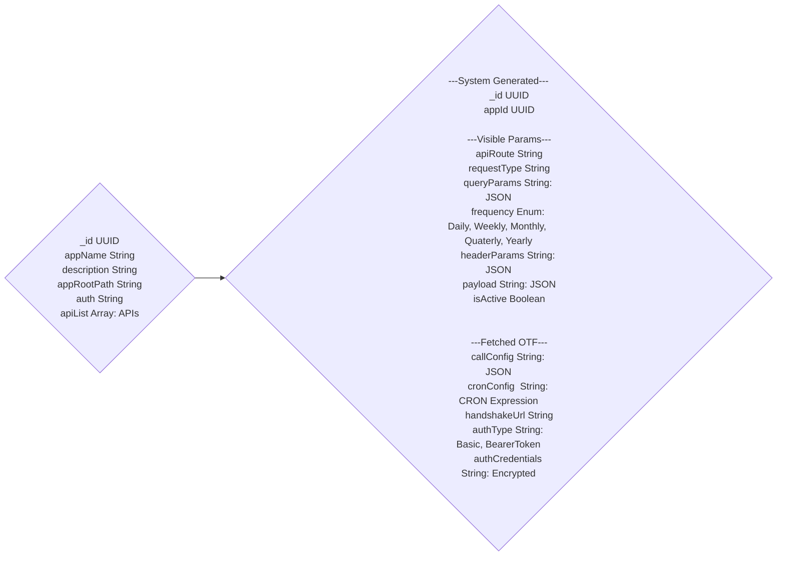

# Cron Task Scheduling and Management API

## Project Overview

### Problem Statement:

-   The need for a streamlined way to schedule, configure, and manage cron jobs for various APIs within different applications in a Node.js/Express/MongoDB environment.
-   Solution: A robust API providing centralized control of cron tasks, enabling scheduled API calls and offering the flexibility to customize and manage jobs efficiently.
    Features

### Application Registration:

-   API endpoints to register new applications, capturing essential information (name, description, API list).
-   API Definition and Scheduling: Ability to define individual APIs within an application, specifying:

    -   Request Type (GET, POST, PUT, DELETE, etc.)
    -   API Name (unique within the application)
    -   Query Parameters (if applicable)
    -   Frequency (Daily, Weekly, Monthly, Yearly, Quarterly)
    -   Header Parameters
    -   Payload (JSON, XML, etc.)
    -   Call Configuration (Overrides to headers/request type and store Authentication Details)
    -   Cron Configuration (Detailed cron scheduling settings)

-   Cron Job Management:

    -   View a consolidated list of all scheduled cron jobs across applications
    -   Enable/disable individual cron jobs
    -   Update the frequency or configuration of existing cron jobs
    -   Get details about the runtime history of cron jobs (optional)

-   Robust Error Handling: Logs and error mechanisms to capture scheduling issues or unexpected behavior.

### API Endpoints (Proposal)

1. POST /applications
   Registers a new application
2. GET /applications
   Fetches a list of all registered applications
3. POST /applications/:appId/apis
   Adds a new API definition under a specific application
4. PUT /applications/:appId/apis/:apiName
   Updates an existing API definition
5. GET /cronjobs
   Returns a list of scheduled cron jobs with status

### Database Schemas



### API walkthrough

1. Register an Application:

```
POST /applications
Payload: {
    "appName": "api-something-something",
    "description": "some description",
    "handshakeUrl": "https://example.com/auth/handshake"
}
```

2. Add an API:

```
POST /applications/12345/apis
Payload: {
   "apiName": "fetch_user_data",
   "requestType": "GET",
   "frequency": "daily",
    ... other API details
}
```

3. View Cron Jobs:

```
GET /cronjobs
```

### API endpoints (Functionality)

1. GET /applications/:appId/apis/:apiName/history :
   Retrieves the execution history of a specific API within an application.
2. POST /cronjobs/:jobId/trigger :
   Triggers a specific cron job for immediate execution.
3. PUT /applications/:appId/apis/:apiName/cronConfig :
   Updates just the cron configuration of an API definition.

## Authentication Strategies (Proposal)

1. Handshake API: Each target application (whose cron APIs you'll be calling) must expose a handshake endpoint. Let's assume it's a standard POST endpoint like:

```
/auth/handshake
```

2. Handshake Request: Your Cron Scheduling API will initiate this handshake call before the scheduled cron execution begins. The request should include any necessary details to authenticate with the target application (application ID, secret, or other pre-shared credentials).

3. Handshake Response: The target application's handshake endpoint will return a success response containing:

-   Authentication Type: (e.g., "Basic", "BearerToken")
-   Credentials:
    -   For Basic Auth: Username and Password
    -   For Bearer Token: The access token itself

4. Credential Storage: Your Cron Scheduling API will store these credentials securely (encryption, secrets manager) associated with the specific API definition.

5. Cron Job Execution: When the cron job fires, your API will retrieve the stored credentials and use them to authenticate the call to the target application's API.
